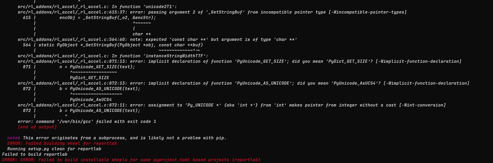

# CVE-2023-33733

https://github.com/c53elyas/CVE-2023-33733

Seem like the reportlab 3.6.12 fail to build with latest system :(

I try to build it on my local machine but fail to build it.

`sudo pacman -S base-devel freetype2 python python-pip python-pillow`

Have all dependencies installed.

- `pip install reportlab` Worked fine.
- `pip install reportlab==3.6.12` Failed to build.