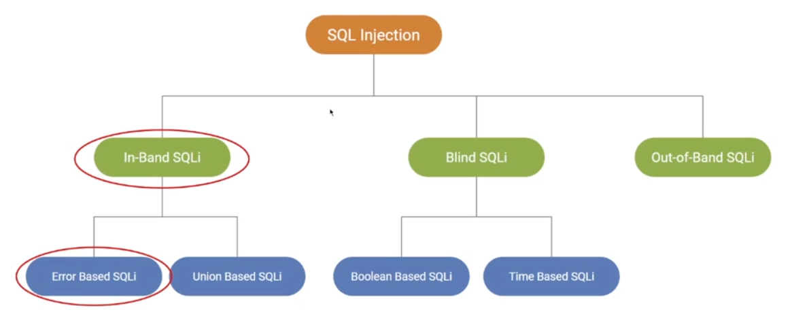

# Web

**OWASP Testing guide**

[Testing guide](https://owasp.org/www-project-web-security-testing-guide/)

[Testing Checklist](http://github.com/0xRadi/OWASP-Web-Checklist)

## Passive

**Whois**
The Name Provider service (GoDaddy, NameCheap) have DNSSec feature that prevent leak the infomation of the target from trace with `whois`

```sh
host <HOST>
whatweb <HOST>
whois <HOST>
whois <IP>

dnsrecon -d <HOST>

wafw00f -l
wafw00f <HOST> -a

sublist3r -d <HOST>
theHarvester -d <HOST>
theHarvester -d <HOST> -b all
```

**Nikto**: Web server scanning
- `nikto --help`
- `nikto -h http://<target_ip>` Basic scan
    - `-o nikto html -Format htm` Html output
    
**Web recon with OWASP Amass**:
- [github repo](https://github.com/owasp-amass/amass)
- Simple enumeration: `amass enum -d zonetransfer.me`
    - `-passive` Passive enum
    - `amass enum -d zonetransfer.me -src -ip -brute -dir /path/to/output` Brute force subdomain
- `amass intel -d zonetransfer.me -active -src -ip -dir /path/to/outp ut`
    - `-whois` Using whois utility
- `amass viz -dir /path/to/output -d3` Visualize format

## Exploit Reflected XSS Vulnerbility in WordPress

WP using plugin to implement feature and stuff. Plugin may have vulns, important to check plugins of Wordpress

[WPScan](https://wpscan.com/)
- `sudo apt install wpscan`
- `wpscan --url <target_url>` - Basic enumeration
    - `--enumeration p --plugins-detection aggressive` - Passive enumeration and aggressive plugin detection.
    - `--api-token <ur_token>` Insert the api token to be able to vulns scan

Example:
- WordPress Plugin Relevanssi 4.0.4 have [vuln](https://www.exploit-db.com/exploits/44366) ~ Reflected XSS
- Need user admin to click on the malicous link that we create
- We can level up the vulns script by steal the cookie of admin user and use that for gain access to the target.

## MyBB Stored XSS

[MyBBScan](https://github.com/0xB9/MyBBscan)

Scanner for plugin of myBB for vulns, run scan and check if any vulns.
- Example: `Download` plugin, copy payload and exploit the plugin
  - `0day.today` ~ 30121

## DOM XSS

Dom ~ Dynamic change data of element in webapp

Typically attacker make change in url, then ship it to victim, victim open url and the DOM XSS will be execute.

## SQLi

Auto scan with ZAP

Get the request that contain SQL, and send it to `FUZZ`
- Select where you want to inject the payload, add the FUZZ
- Run and check the request have a `reflected`



In-band SQL injections - The attacker use the same communication channel to send and recivce the results
- Example: SQLi on login page - The error return on the login page as well

Error-base: Relies on intentionally causing database errors and using the error messages returned by the database to extract information of gain access.

[SQLMAP](https://sqlmap.org/)
- `sudo apt-get install sqlmap`
- `sqlmap -u "http://demo.ine.local/dosearch.php" --data "<data_exploit>" -p <parameter> --method POST`
- Alternitive, Save the request from burpsuite and run.
    - `sqlmap -r <request_file> -p <parameter> --technique=E`
    - `--technique=E` Error base.
    - For bug-bounty and pentest - set the risk level and provided level is 1
- If sqlmap identified the vulns, further attack can be perform
    - `--current-db` get current db name
    - `-D <database>` Select the db -> `-D <database> --tables` -> List table
    - `-D <database> -T <tables> --dump` Dump the table
    - `--os-shell` If shell available, open shell

Union-based: Using Union operation, the attacker inject additional `select` statement through the vulnerble input to retrive the data.

**Example**:
- If search text have vuln, and exploit is `'or 1 = 1 --`
- Base on response of the web, to see the table have how many column
    - `'or 1 = 1 union select 1,2,3,4,5` Check until the page responsed.

## XSSer

`xsser --url <target_url> -p <parameters>`
- Using custom payload `--Fp <payload>` (Final payload )