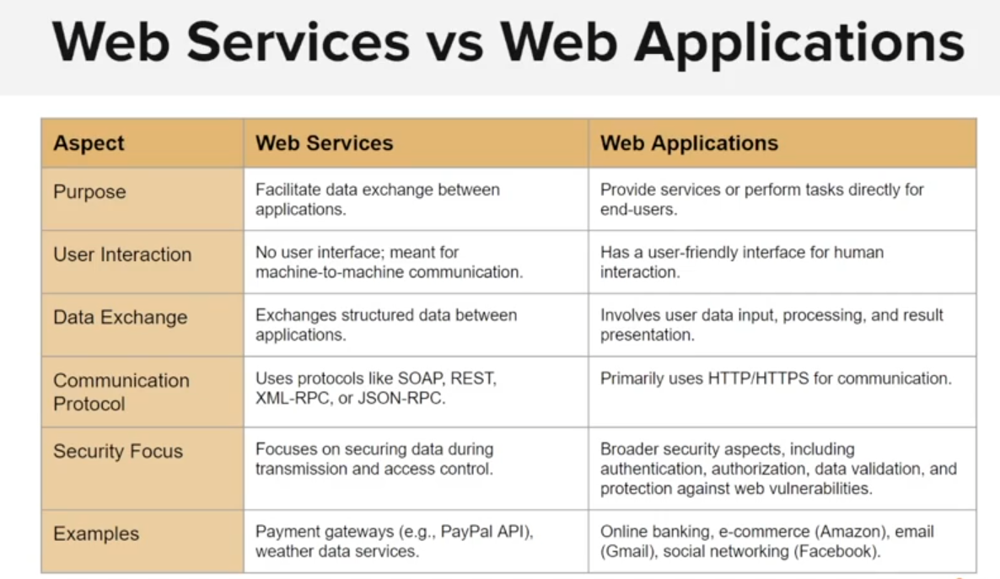

# Web service

Purpose: Facilitate communication and data exchange between different software system over the internet.
- They provide a standardized way for different applications to interact with each other, often using protocols like SOAP or REST

Web services are typically use for machine-to-machine communication, and are not meant for direct human interaction

Keywords: Web services is for machine to machine, setup run and done.

