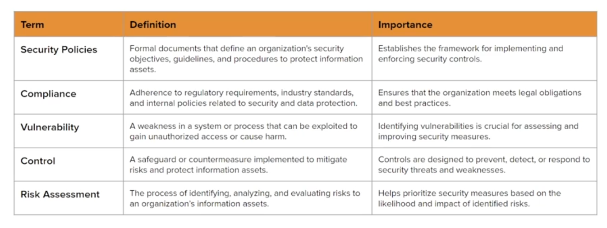
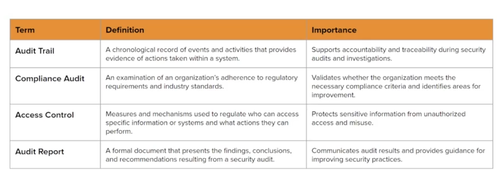
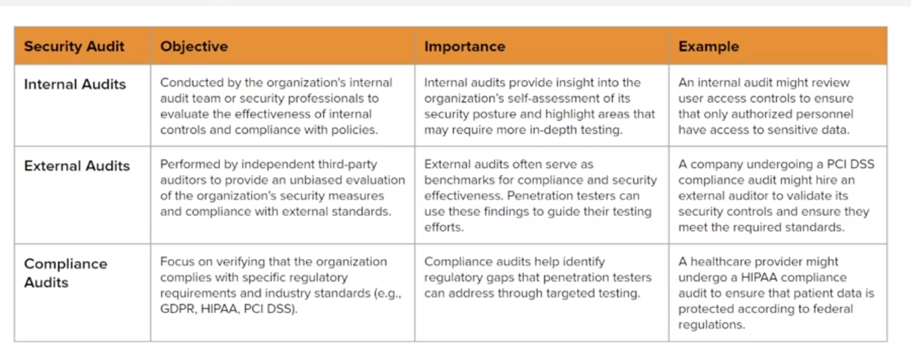
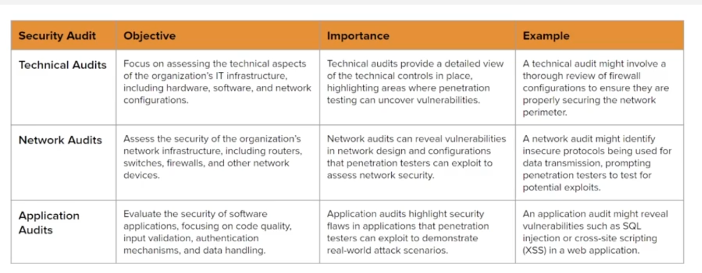
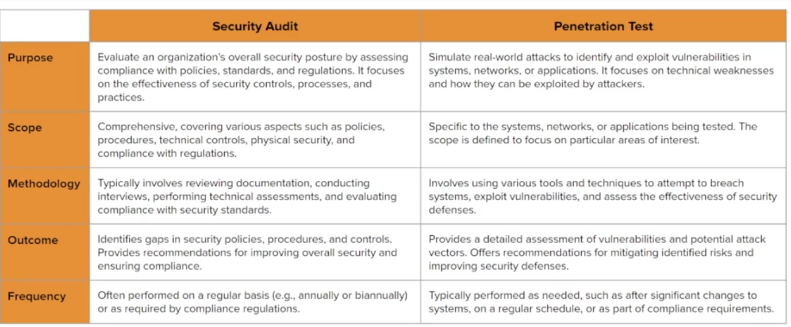

# Security audit

Sysmetic process of evaluaing and verifying the security measures and control in place to ensure they are effective, appropriate and compliant with relevant standards policies and regulations
    - Regular audit ensure that security controls are effective and up-to-date, minimizing the risk of breaches.
    - Orgs must comply with variours regulatory requitements and industry standards.
        - Such as GDPR, HIPAA, PCI DSS, ISO 27001.

### Essential terminology

### Process

- Plan and preparation
    - Define Objectives and Scope.
    - Gather relevant Document.
    - Establist Audit team and schedule.
- Information gathering:
    - Review policies and procedures.
    - Conduct interviews.
    - Collect technical information.
- Risk assessment
    - Identify assets and threats.
    - Evaluate vulns
    - Determine Risk levels.
- Audit execute.
    - Perform technical testing (Include penetration test)
    - Verify compliance
    - Evaludate control.
- Analysis and evaluations
    - Analyze finding
    - Compare against standards
    - Piroritize issue.
- Reporting
    - Document finding
    - Provide recommentdation
    - Present the results
- Remediations
    - Develop remediation plans
    - Implement
    - Monitor and Update.

### Type

### Security audit & Penetration testing

- Perform Security audit first then perform penetration test after.
- We can combine security audit and penetration test

### GRC Governance Risk & Compliance

Comprehensive framwork use by orgs that orgs achieves Object, manage it risk and compli with regulation.
- `Governance` refer to framework of police, produce ...
- Risk is identify, assessment, mitigation risk
- Compliance: Ensure compliance

Purpose:
- Comprehensive security assessment.
- Enhance reporting

**Framework:** Sructure approach, large and flexiable
- NIST Cyber frameword (CSF)
- COBIT

**Standard**: Set of specific requirement
- ISO/IEC 27001: Worldwide system security magement.
- PCI DSS - Protect payment, customer info
- HIPAA: Protect sensitive patient information
- GDPR: EU standard for data protection

**Guideline**: Recommend practice and advice:
- CIS: Best practice and step to improve security 
- NIST SP 800-53: Security control for federal information.

## Design a security policy
- System design follow rule
    - [NIST SP 800-53](https://csrc.nist.gov/pubs/sp/800/53/r5/upd1/final)

- Security audit with [Lynis](https://cisofy.com/lynis/)
    - Run lynis perform security scan and generate report `lynis audit system`
        - Specify test `lynis audit system --tests <test_id>`
    - Remediation
- Conduct pentest 
    - Tools for remediation `fail2ban` rate limit, prevent brute force
