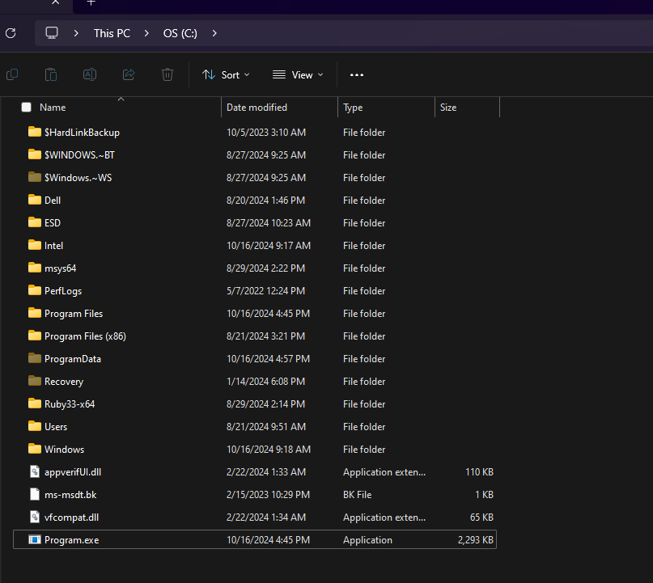
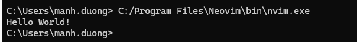

## AnyDesk 7.0.15 - Unquoted Service Path 

Ref: https://www.exploit-db.com/exploits/51968


### 1. Description:

The Anydesk installs as a service with an unquoted service path running
with SYSTEM privileges.
This could potentially allow an authorized but non-privileged local
user to execute arbitrary code with elevated privileges on the system.

### 2. Proof

```
C:\>sc qc anydesk
[SC] QueryServiceConfig SUCCESS

SERVICE_NAME: anydesk
        TYPE               : 10  WIN32_OWN_PROCESS
        START_TYPE         : 2   AUTO_START
        ERROR_CONTROL      : 1   NORMAL
        BINARY_PATH_NAME   : "C:\Program Files (x86)\AnyDesk\AnyDesk.exe"
--service
        LOAD_ORDER_GROUP   :
        TAG                : 0
        DISPLAY_NAME       : AnyDesk Service
        DEPENDENCIES       : RpcSs
        SERVICE_START_NAME : LocalSystem
```


```
C:\>systeminfo

OS Name:  Microsoft Windows 10 Pro
OS Version: 10.0.19045 N/A Build 19045
OS Manufacturer: Microsoft Corporation
```

## Research - investigate

### What does this mean?

Here's a breakdown:

1. Unquoted service path:
    - When a service path (the file path to the executable) is not enclosed in quotes, and it contains spaces (e.g., C:\Program Files\AnyDesk\anydesk.exe), the system might misinterpret the path.
    - For example, if the system sees C:\Program Files\AnyDesk\anydesk.exe, it might mistakenly try to execute C:\Program.exe first, if such a file exists, before checking the full path.

2. Running with SYSTEM privileges:
    - The service is running with SYSTEM privileges, the highest level of privilege on a Windows machine. If a malicious user manages to exploit the unquoted service path, they could potentially execute their own code with SYSTEM-level access.

-> Potential exploitation:
        A non-privileged, local user (i.e., someone without administrative rights) could place a malicious executable in a path that gets interpreted first by the system, leading to arbitrary code execution with elevated (SYSTEM) privileges.

**Risk:**

- This vulnerability could allow a local attacker to take over the system by escalating their privileges, which is a serious security concern.

- To mitigate this, the service path should always be enclosed in quotes to avoid ambiguity in how the system interprets file paths.

**CWE:**
- [CWE-426: Untrusted Search Path](https://cwe.mitre.org/data/definitions/426.html)

**Demo:**

1. Create file Program.exe (hello world cpp) and place it in C folder

    

2. Try to run some exe file from C folder without quote the path
   1. It run `Program.exe`

    