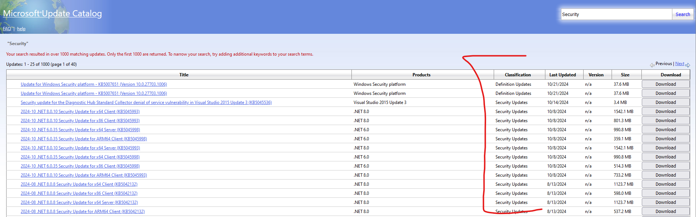

# Windows Update

## Basic knowledge

- **Windows KB:** It reference particular Windows update
  - It also refers to a "Knowledge Base" article that Microsoft publishes to provide information about a specific issue, update, or fix related to their products, especially Windows
  - Can search it on: https://www.catalog.update.microsoft.com/Home.aspx

- **Superseded KB:** refers to a Windows update that has been replaced or rendered obsolete by a newer update.
  - When an update is superseded, it typically not offered to users through Windows Update anymore
  - The replace update includes all of the changes from the original update, along with additional fixes or improvements. Essentially, the newer update is considered a more complete or updated version, and the older one is no longer necessary.

- **DISM (Deployment Image Servicing and Management):** Is a command-line tool in Windows used to service and prepare Windows images
  - Service Windows images: DISM allows you to modify Windows image files (.wim), virtual hard disk (.vhd), and .vhdx files. This includes adding or removing Windows features, drivers, updates, and language packs.
  - Manage Windows features and packages
  - Repair Windows installations: DISM can be used to repair a running Windows installation, especially when system files are corrupted.

- **wsusscn2.cab file:** is a database of security updates released by Microsoft for every version of Windows from 2000 to 11, and Microsoft Update products such as Office and SQL Server. You can use this file to determine which updates are missing on a PC, without being connected to the internet.
  - It only `Security Updates`. You can look what `Classification` of the KB on the catalog website.

    
  - Ref: [Main Page](https://legacyupdate.net/wsusscn2) - [Download Link](http://download.windowsupdate.com/microsoftupdate/v6/wsusscan/wsusscn2.cab)

### Common fix when Windows Update is fail or corrupted

#### Method 1:

Open Command Prompt as an administrator and run these command below

```sh
# Checks if the image has been flagged as corrupted.
> Dism /Online /Cleanup-Image /CheckHealth
# Scans the Windows image for any corruption.
> Dism /Online /Cleanup-Image /ScanHealth
# Repairs any detected corruption using Windows Update or a specified source file.
> Dism /Online /Cleanup-Image /RestoreHealth
# Scan and repair corrupted or missing system files.
> sfc /scannow
```

#### Method 2:

1. Download the latest Windows ISO.
2. Extract the ISO file or mount the Windows ISO as a drive.
3. Run `dism /online /cleanup-image /restorehealth /source:WIM:E:\sources\install.wim:1 /limitaccess` with E: is the drive we mount the ISO
4. Open Command Prompt as an administrator and run these command below
    ```
    > Dism /Online /Cleanup-Image /CheckHealth
    > Dism /Online /Cleanup-Image /ScanHealth
    > Dism /Online /Cleanup-Image /RestoreHealth
    > sfc /scannow
    ```
#### Method 3:
Using with caution. We will fixing the Component file.
1. Backup the file `C:\Windows\System32\config\COMPONENTS`
2. Using tool [Component Scanner](https://www.sysnative.com/forums/threads/how-to-check-your-components-registry-hive-for-corruption.35379/) to scan and fix the corrupted `COMPONENTS` file
   - It will output the `ComponentsScanner.txt` file. Check it to know more details.
3. Replace the the new `COMPONENTS` file to the folder `C:\Windows\System32\config\`
4. Open Command Prompt as an administrator and run these command below
    ```
    > Dism /Online /Cleanup-Image /CheckHealth
    > Dism /Online /Cleanup-Image /ScanHealth
    > Dism /Online /Cleanup-Image /RestoreHealth
    > sfc /scannow
    ```