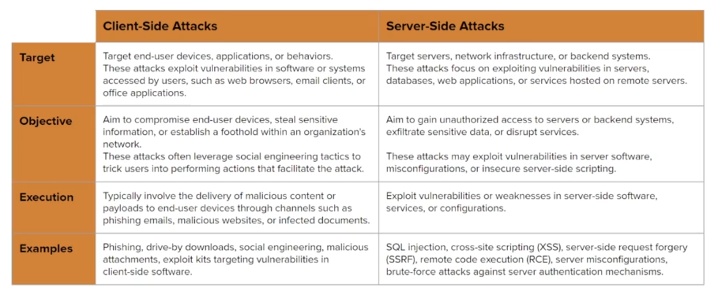

# Client side attack

Refer to technique used to exploit vuln or misconfig in client-side software or the system accessed by user/employees of a target organization (Not targeting the server, target employees)

In client-side attacks, attacker deliver the malicous code via standard delivery mechanisms like email, USBs, compromised website, etc.

Pharse:
- Reconnasissance
- Target identification
- Payload, resource development
- Payload Preparation
- Payload delivery
- Payload excution
- Post exploit

**Client-side attack vector**: Refer to method/path used by attacker to exploit.
- Social engineering
    - Tools: SET, Phishme, BeEF
- Drive by download
- Water hole attacks
- Malicious documents/Payload
- USB-base attacks
- Exploit kits
- Brower exploitation

---

**Information gathering**:
- Passive: 
- Active: 

**Client fingerprinting**: An atice client information gathering technique used to gather infor about target system web brower and underlying OS in order to aid in ther developemtn of tailor made (client specific) payload for initial access

**Browser Fingerpriting**: Leverages client-side scripting language like JS to extract info about target browser and underlying OS
- Set up fake webpage to runs a specific JS script when users visit the webpage
    - Some browers can block JS execution
- Infor should collect
    - Web browser and their version
    - Plugin/Extensions
    - Underlying OS infor
- Tools:
    - [FingerprintJS2](https://github.com/LukasDrgon/fingerprintjs2)
        - Setup website with apache and try to run it

## Resource developemt and weaponizations

- Resource focuses on acquiring or building the necessary resources for an attack
    - [Att&ck resource Development](https://attack.mitre.org/tactics/TA0042/)
- Weaponization involves turning those resource into effective cyber weapons

Term used by:
- MITRE ATT&CK framework
- [Cyber kill chain (Lockheed Martin)](https://www.lockheedmartin.com/en-us/capabilities/cyber/cyber-kill-chain.html)

[Pharse exploit](./Assets/image_1.png)