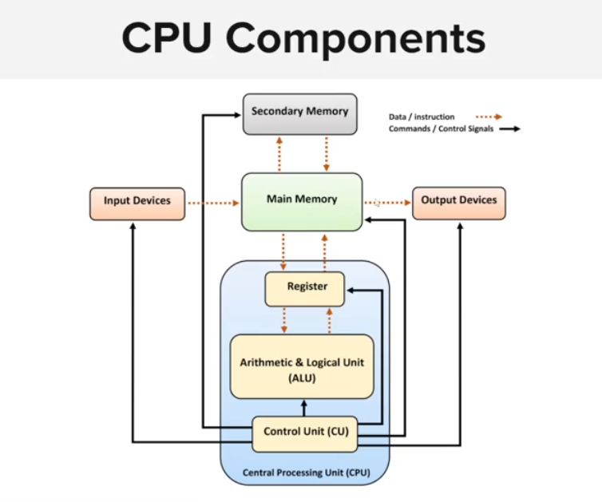

## Assembly

- Each CPU has it own instruction set.
- Assembly language is closely tied to the architecture of the target CPU
    - x86 assembly language is used for Intel and AMD.
    - ARM assembly language is used for ARM-based processor.



Registers:
- PC: Progam counter
- IR: Instructions
- Accumlator: Store the result of arithmetic and logic operations
- General-purpost registers

## How this mf work

Think it like you run a sequece of syscall

Example, like hello world:
- Call `write`
- Call `exit`
- Goto https://syscalls.w3challs.com/?arch=x86
- Represent the syscall with correct value of register
- we use `mov` to move data to register
- Call `init_module` to run the system call
- Opcode ref https://en.wikipedia.org/wiki/X86_instruction_listings

```asm
; Hello world!
; Author: Frenda

section .data
	hello db 'Hello, world!',0xA  ;Null terminated string

section .text
	global _start

_start:
	mov eax, 0x4 ; Move syscall 0x4 (sys_write) to eax
	mov ebx, 0x1 ; File descriptor 1 (stdout)
	mov ecx, hello ; Pointer to string
	mov edx, 13 ; Length of the string
	int 0x80 ; Call kernel

	; Gracefully Exit
	mov eax, 0x1 ; System call (sys_exit)
	xor ebx, ebx ; Return 0, store in ebx
	int 0x80 ; Call kernel
```

Complie with `nasm -f elf hello.asm` -> Output `hello.0` file
Linking `ld -m elf_i386 -o hello hello.o` -> Output executable `hello`

### Data and variable

Using gdb to disassembly exe

- `gdb -q <exe_file>`
- `set disassembly intel` Disassembly intel chip
- `set pagination off`
- `info functions` view functions
    - `disass start` Disassembly the `_start` functions
    - `br *_start + 14` Set breakpoint from start +14
    - `r` ~ `run`
    - `info variables` Show all variables symbol
    - `x/s &val` Show `val` variable
    - `set {char[8]} &hello = "hi Manh\n"` Set new value for var `hello`
- `info registers` Register info
- `info locals` to list "Local variables of current stack frame"
- `info args` to list "Arguments of the current stack frame" 

# Buffer overflow.

Unsafe operations:
- strcpy
- strcat
- gets/fgets
- vsprintf
- printf
- memcpy

Hunting buffer overflow: Follow the crash, see it crash by buffer overflow or not by using debugger

Company usually fuzzing before release, common buffer overflow it hard to find.

Fuzzing is a software testing technique the provides invalid data, unexpected or random to the program.