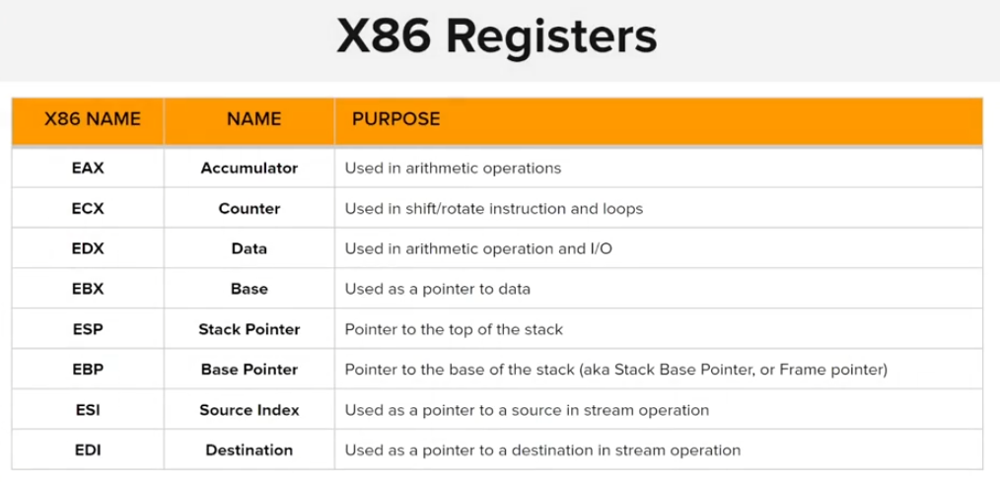
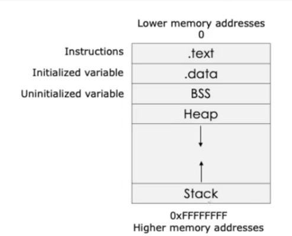
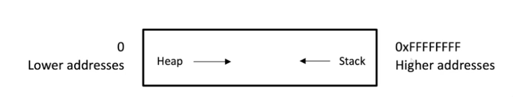
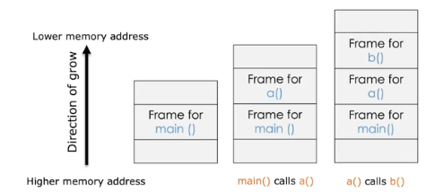
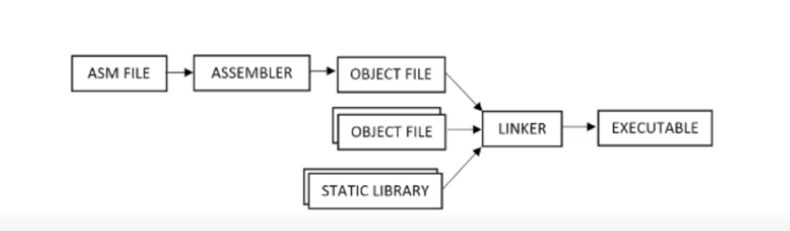

- Each CPU has it own instruction set.
- Assembly language is closely tied to the architecture of the target CPU
    - x86 assembly language is used for Intel and AMD.
    - ARM assembly language is used for ARM-based processor.
- The architecture of the CPU (32 or 64 bit) refer to the width/size of the CPU Register
  - General Purpose registers (GPRs): Used to store data temporarily during program execution
  - Each CPU have it fixed set of registers that are accessed when required.

Type of GPRs: (32 bit)
- EAX, EBX, ECX, EDX: General data manipulation and arithmetic operations
- ESI, EDI: Often used for string manipulation operations
- ESP, EBP: Used for managing the stack (ESP ~ Stack pointer, EBP for base pointer)

32 bit start with an 'E', 64 bit start with a 'R' ~ RAX, RBX, RCX, RDX, etc

- EIP: Instruction pointer: Store address point to the next instruction.

## Process memory

Modern OS implement a concept known as virtual memory, which abstracts physical memory resource and presents each process with a virtual address space

- Code segment
- Data segment
- BSS segment: Uninitialized data.
- Heap segment
- Stack segment

ESP stack pointer, contain address of the top of the stack.

**Procedure & Functions**:
- Functions contains two important components, the prologue and the epilogue.
  - The prologue prepare the stack to be used, similar to putting a bookmark in the book
  - When the functions has completed, the epilogue reset the stack to the prologue settings 

A **call stack** is composed of 1 or many several **stack frames**. Each stack frame corresponds to a call to a function or procedure which has not yet terminated with a return.

To use a **stack frame**, a thread keeps two pointers, one is called the **Stack Pointer (SP)**, and the other is called the **Frame Pointer (FP)**. SP always points to the "top" of the stack, and FP always points to the "top" of the frame. Additionally, the thread also maintains a **program counter (PC)** which points to the next instruction to be executed.

The following are stored on the stack frame:
- local variables and temporaries;
- actual parameters of the current instruction (procedure, function, etc.).

There are different calling conventions regarding the cleaning of the stack.

[Stack Frame](https://stackoverflow.com/questions/10057443/explain-the-concept-of-a-stack-frame-in-a-nutshell)

Example: Main() -> a() -> b()

## Assemblers

Assembly -> Machine code.

- MASM Microsoft Marco Assembler
- GNU Assembler

