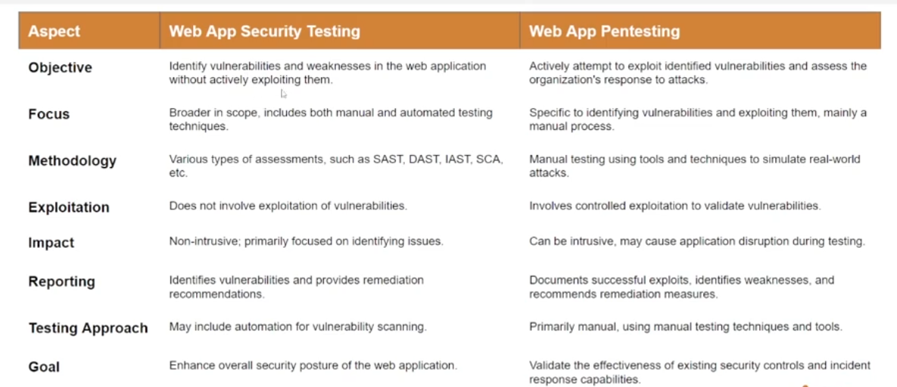
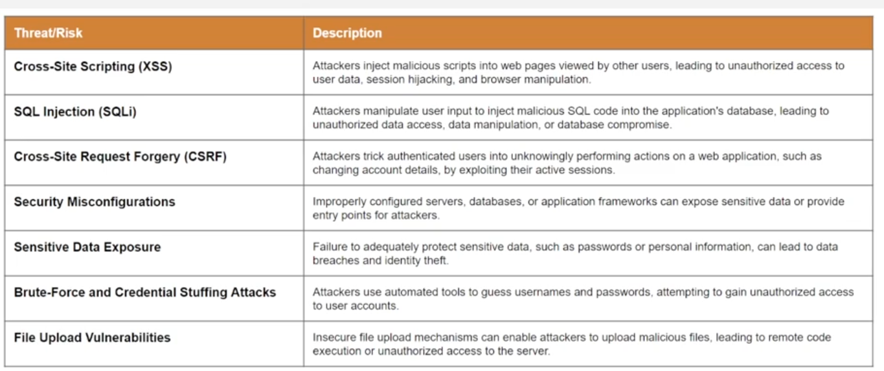
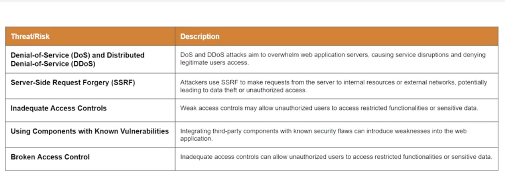
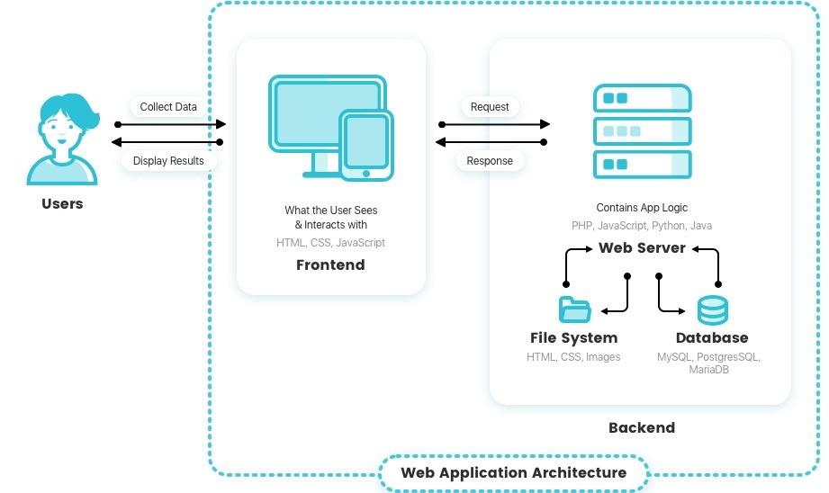

# Web app security

Ensure confidentiality, integrity and availability 

BY:
- Regular security Update
- Least privilege principle
- Web application firewall
- Session management 
- Input validation
- Authentication and authotization
- Secure communication (TLS/SSL)
- Secure coding practice.

Security tesing for webapp include:
- Vulnerabiliry scanning
- Penetration testing
- Code review and static analysis

Types:
- Authen and author testing
- Input validate testing
- Session management testing
- API security testing

Key different between web app pentest and web app security testing 

---

Web app threat & Risks
- Threat refer to any potential source of harm and adverse event that may expoit vulnerabiliry in a system.
    - Threat can be human-made (Phishing, exploit ..) or natuarl
- Risk is potential for a loss or ham resulting from a threat exploit a vulnerability in a system or organization.
    - Risk is often meansurds in term of the likelihood of an incident happening and the potential magnitude of its impact

Common threat and risks

## Web app architecture

Usually use client-server Model

Client-side processing need:
- User Interaction: Client-side processing is well-suited for tasks that require immediate user interaction and feedback, as there is no need to send data back and forth to the server.
- Responsive User Experience: Since processing happens locally, client-side operations can provide a smoother and more responsive user experience.
- JavaScript: JavaScript is the primary programming language used for clientside processing. It allows developers to manipulate the web page's content, handle user interactions, and perform validations without involving the server.
- Data Validation: Client-side validation ensures that user input meets specific criteria before it is sent to the server, reducing the need to make unnecessary server requests.

Server-side porcessing include:
- Data Processing: Server-side processing is ideal for tasks that involve sensitive data handling, complex computations, and interactions with databases or external services.
- Security: Since server-side code is executed on a trusted server, it is more secure than client-side code, which can be manipulated by users or intercepted by attackers.
- Server-side Languages: Programming languages like PHP, Python, Java, Ruby, and others are commonly used for server-side processing.
- Data Storage: Server-side processing enables secure storage and management of sensitive data in databases or other storage systems.

## Web app tech

- Data interchange refers to the process of exchanging data between different computer systems or applications, allowing them to communicate and share information.
- APIs (Application Programming Interfaces) - APIs allow different software systems to interact and exchange data.
- REST (Representational State Transfer) - REST is a software architectural style that uses standard HTTP methods (GET, POST, PUT, DELETE) for data interchange. It is widely used for creating web APIs that allow applications to interact and exchange data over the internet.
- SOAP (Simple Object Access Protocol) - SOAP is a protocol for exchanging structured information in the implementation of web services. It uses XML as the data interchange format and provides a standardized method for communication between different systems.
- Content Delivery Networks (CDNs) - CDNs are used to distribute static content (e.g., images, CSS files, JavaScript libraries) to multiple servers located worldwide, improving the web application's performance and reliability.

## HTTP

Is stateless applications layer protocol used for transmission of resource llike web applicaiton data and run on top of TCP

HTTP have 2 version: 1.0 and 1.1.
- `1.1` support for persistent connections, reducing the overhead of establishing a new connection for each request.

**HTTP request components**:
- Request line:
    - HTTP method
    - URL
    - HTTP version
- Request header: Additional infor about request
    - User-agent: Infor about client
    - Host: host name of the server 
    - ACCEPT: The media type the client can handle in response
    - Authorization
    - Cookie
- Body

**HTTP response components**:
- Response Headers:
    - Content-Type: The media type of the response content (e.g., text/html,
application/json).
    - Content-Length: The size of the response body in bytes.
    - Set-Cookie: Used to set cookies on the client-side for subsequent requests.j
    - Cache-Control: Directives for caching behavior
    -  Accept header is used by your browser to specify which document/file types are expected to be returned from the web server as a result of this request.
    - Accept-Encoding header is similar to Accept, and is used to restrict the content encoding that is acceptable in the response.
    - Referer: Previours refer http request of current request
- Response Body (Optional): The response body contains the actual content of the response.o

**Curl**:
- `-I` Send HEAD instead of GET
- `-X OPTIONS <url>` Check method that supported of specific URL (Each URL support set of method differently)
    - Response `ALLOW: GET, PUT, ....` List all method that we can send
- `curl <url> --upload-file /path/to/file` Upload file 
    - Can use to upload webshells to vuln website.

**Internet packet communication steps**:
- 3 Way handshake to establish connections
- Request HTTP sent
- Response from HTTP
- Client will send ACK if it need other resource, like style sheet, or JS
    - It follow by another http request

**Crawling and spidering**
- Crawling is the process of navigating around the web application following links, submit forms ...
- Spidering is the process of auto discover new resource on a web app
