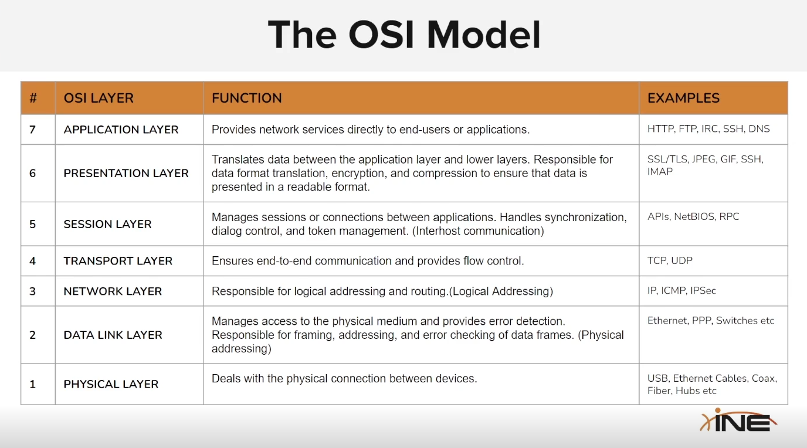
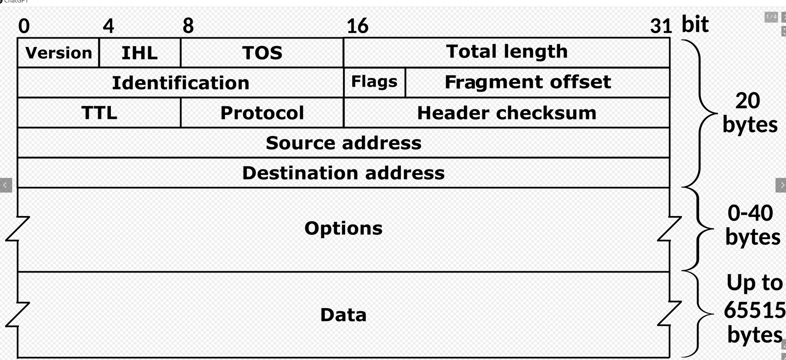
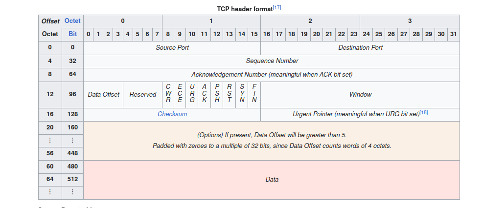

# Network fundamentals

Package: Stream of bits that transfer via network.

Have 2 part:
- Header (Distint between different type of package)
- Payload

OSI (Open system interconnection) ~ 7 layer (Concept framework)

## Network layer

Responsible for logical addressing and routing (IP, ICMP, IPSec) (Layer 3)

IP (Internet protocol):
- Ipv4: 32-bit address
- Ipv6: 128-bit address

ICMP (Internet control message protocol) 
- Ping
- Traceroute
- Error message

**Package Structure:** 
- Header contains: Source and des IP, version number, Time-to-live (TTL) and protocol type.

**Fragmetation and reassembly**
- Ip allow data be fragment, contains many package.
- Small package can be reassembly to contruct original data.

**Subneting**: Technique divides a large IP network into smaller, better for control and security.

**IP-type:**
- One to one: Direct communication.
- Broadcast: Connect to all device in subnet
- Multicast: Connect to group of device

**DHCP**: Dynamic assign IP to device in the network.

[More details about each field](https://en.wikipedia.org/wiki/IPv4)

## Transport layer
- TCP: Connect oriented protocol
    - Ensure receive accurately data.
    - Establish a connection between the sender and receiver before data exchanged.
- UCP: Connectionless protocol.
    - No guarantee data transfer correctly.

TCP 3-way handshake:
- It involve a series of 3 message exchange between sender and receiver,
    - SYN: Client sending TCP segment with SYN flag set
    - SYN-ACK: Server receive SYN, response with a TCP segment with both SYN and ACK flag set.
    - ACK: Client resent TCP segment with ACK flag set.
    - After the 3-way handshake, the ACK number in subsequent segment are use to confirm the receipt of data and management the flow.

[More details about each field](https://en.wikipedia.org/wiki/Transmission_Control_Protocol)

## Practice 

- `netstat -antp` Check tcp connection
- [Wireshark](https://www.wireshark.org/)

# Host discovery

Network mapping is the process of discovering and identifying devices, hosts, and network infrastructure elements within a target network. 

**Host discovery techniques**:
- **Ping Sweeps**: Just ping
- **ARP Scanning**: Using ARP request to identify host in local network.
- **TCP SYN ping**: Send TCP SYN to specific port to check if host is alive.
- **UDP ping**: Send UDP package to check host is alive
- **TCP ACK Ping**: Sending TCP ACK package to specific port to check it alive
    - Except no response, but TCP RST (reset) is received, indicate that host is alive.
- **SYN ACK Ping**: Sending TCP SYN-ACK ...

## Ping Sweeps

`ping <target>`

- Request (Type 8)
- Reponse (if success, Type 0)

- `-c <number>`: Number of request
- `ping -b -c 1 <Broadcast IP>`: Ping all devices in the subnet
    - Or use `fping` `fping -a -g 10.10.23.0/24`

## Nmap

- With `-sn` options (not port scan, using for host discovery), nmap using Ping in the most of request
    - Use `--send-ip` to tell nmap send tcp package
- Use `nmap -sn <target> <target>` or `nmap -sn <target>-<range>` to scan more than one target
    - Target list file `nmap -sn -iL targets.txt`
- `-PS` specify that using SYN scan `nmap -sn -PS <target>`
    - Specify port `-PS22` or `-PS1-1000` or `-PS80,443,3389`
- `-PA` specify that using ACK scan
    - In many enviroment, system block ACK ping, or RST response
- `-PE` only send ICMP echo request

Adviser:
- Start with `nmap -sn -v -T4 <target>`
- Add port `namp -sn -PS21,22,80,443,445,3389,8080  -T4 <target>`

## Port scanning
- `-Pn` port scan (skip host discovery)
- `-F` common port
- `nmap -Pn -sS -F <target>` Stealth scan (Use syc scan, doesn't complete connection)
- TCP connect scan `nmap -Pn -sT <target>` (Complete the connection, then send RST ACK to close connection)
- Scan UDP port `-sU`
- Version and service `nmap -T4 -sS -sV -p- <target>`
- `-O --osscan-guess` tell `nmap` try to guess OS Aggressively
- `-sV --version-intensity` Tell `nmap` try hard to detect the version
- `-sC` default script, `--script=<script name>` specify script
- `--script-help=<script name>` info about script
<<<<<<< Updated upstream
- Some udp port `namp -sn -PS21,22,80,443,445,3389,8080 -PU137,138 -T4 <target>`

**Script**:
- `nmap --script <script_name> --script-args` script name and args (if any) 

**IDS invation** 

- Fragment the packet with `-f` `nmap -Pn -sS -F -f <target>`
    - `--data-length` for specify data length
- `-D` decoy IP
    - `nmap -D RND:10 192.168.1.200` random decoy
    - `nmap -D <ip>,<ip>,ME <target>` specify IP, and `ME` is real scanning IP
- `--scan-delay` delay between packet scan
    - Usually 15s for high security system
- `--host-timeout 5s` timeout for discover host
    - Usually 30s for large system

**Output format**:
- `-oN` normal format ~ same as terminal format
- `-oX` XML format, can export to metasploit framework
- `-oG` Grepable format
- `-oA` Output in 3 above format at once
- `-v` verbose
- `--reason` Display the reason why port has that result
- `--open` only show open port
